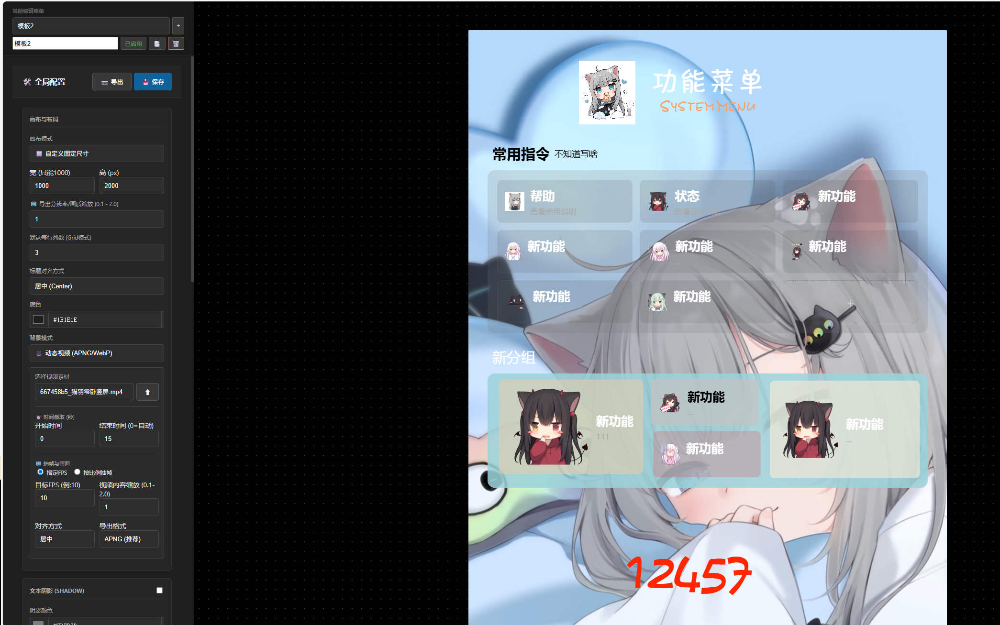

# 测试版本有问题lssues 不咋会写md 可能有漏 请上演示测试
# 🎨 可视化菜单编辑器
> **架构**: Multiprocessing (Spawn) + Quart + Pillow  
> **适配**: AstrBot (Star 协议)

**拒绝手写 JSON，拒绝繁琐配置！**  
这是一个为 [AstrBot](https://github.com/Soulter/AstrBot) 量身打造的高级可视化功能菜单生成器。通过 Web 界面**所见即所得**地设计你的机器人菜单，支持**拖拽布局**、**自由缩放**、**自定义字体**与**全配色管理**。

---
## 问题反馈
可以进饰乐的群，460973561
版本报错请手动更新   
pip install -U pillow              
pip show pillow

## 依赖安装
```text
pip install Pillow imageio imageio-ffmpeg
```


## 效果展示

展示网站 [效果展示，演示网站]( http://124.156.214.104:9876/) 密码：astrbot123


**示例:** `菜单展示`

|  |
|:----------------------------------------:|
|                  *菜单效果*                  |
**示例:** `web界面展示`

|  |
|:----------------------------------------:|
|                 *分组功能展示*                 |
**示例:** `界面展示`

|  |
|:----------------------------------------:|
|                 *菜单功能展示*                 |
**示例:** `llm判断是否发送`

|  |
|:----------------------------------------:|
|                 *菜单功能展示*                 |
**示例:** `动态壁纸演示`

|  |
|:----------------------------------------:|
|           *动态壁纸展示具体可以上演示网站查看*            |
---
## ✨ 核心特性

*   **🖥️ Web 可视化编辑器**：内置独立 Web 后台，实时预览，修改即保存。
*   **🖱️ 自由拖拽交互**：
    *   支持**鼠标拖拽**任意改变文本位置。
    *   支持**右下角手柄**拖动缩放字号。
*   **🎨 全自定义外观**：
    *   **背景图**：支持上传自定义背景，**长图自动适应**，不截断。
    *   **字体库**：Web 端直接上传 `.ttf/.otf` 字体，浏览器与生成图实时同步。
    *   **全配色**：主标题、副标题、分组、功能名、描述均可独立设色。
*   **🛡️ 稳定性**：
    *   采用 `multiprocessing (spawn)` 独立进程架构。
*   **⚡ 动静分离**：
    *   Web 端只负责编辑，生成配置后自动渲染为静态图片。
    *   关闭后台后，Bot 依然可以毫秒级发送菜单，**零内存占用**。
*   **🔐 权限控制**：只有配置文件中指定的管理员 (`admins_id`) 才能开启后台。

---

## 📂 目录结构 (安装前必看)

请确保你的插件目录结构如下，否则可能无法启动：

```text
astrbot_plugin_custom_menu/
├── main.py
├── web_server.py
├── storage.py
├── _conf_schema.json
├── README.md
│
├── fonts/              <-- [必须] 必须包含 title.ttf 和 text.ttf
│
├── renderer/
│   ├── __init__.py
│   └── menu.py
│
├── static/
│   ├── style.css
│   └── editor.js
│
└── templates/
    ├── index.html
    └── login.html
```

---

## 🛠️ 安装与依赖

1. 安装 Python 库  

本插件依赖轻量级异步 Web 框架和图像处理库，请在 AstrBot 环境下运行：

code  
Bash

```bash
pip install quart hypercorn pillow
```

2. 放置插件  

将插件解压至：

```text
AstrBot/data/plugins/astrbot_plugin_custom_menu/
```

3. 首次运行  

重启 AstrBot。  
如果之前运行过旧版本，建议删除 `data/menu.json` 以便生成新的数据结构。

---

## 🎮 使用指南

1. 开启后台 (仅管理员)

在 Bot 聊天窗口发送指令：

code  
Text

```text
/开启后台
```

Bot 会返回一个访问地址（如 http://你的IP:9876）和登录密钥。

2. Web 编辑流程  

登录：浏览器打开地址，输入密钥。  

上传素材：  
* 上传背景图。  
* 上传字体文件（支持中文预览）。  

调整布局：  
* 选择列数（1~5 列自动网格）。  
* 设置标题对齐方式（左 / 中 / 右）。  

自由组件：  
* 点击 “+ 添加” 增加自由文本。  
* 在画布中拖拽移动位置。  
* 拖动文本框右下角手柄调整大小。  

保存：  
* 点击左上角 “💾 保存并生成”。

3. 发送菜单  

回到 Bot 聊天窗口发送：

code  
Text

```text
/菜单
```

即可看到刚刚设计好的菜单图片。

4. 关闭后台  

编辑完成后，建议关闭 Web 服务以释放资源：

code  
Text

```text
/关闭后台
```

---

## ⚙️ 配置文件

可在 AstrBot 管理面板或 plugin_config.json 中修改：

* web_host  
* web_port  
* web_token  
* admins_id  

---


## ❓ 常见问题 (FAQ)

**Q1: 开启后台后，浏览器打不开？**

检查配置中 web_host 是否为 0.0.0.0。  
云服务器请在安全组中放行端口。  
Docker 用户请确认端口映射。

**Q2: 修改了样式，但网页上没变化？**

这是浏览器缓存导致的。  
请使用强制刷新或无痕窗口访问。

**Q3: 生成的图片里全是方框？**

这是因为缺少字体文件或文件名不正确。  
请确保 fonts 目录下存在 title.ttf 和 text.ttf。

**Q4: 提示“权限不足”？**

请在 AstrBot 全局配置中将你的 ID 加入 admins_id。

**Q5: 点击“开启后台”提示进程退出？**

请检查插件目录下的 web_crash.log。  
常见原因是端口被占用或依赖未安装。

---

## 📝 更新日志
